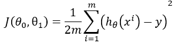

Algorithm Design Process:
Before implementing Gradient Descent, we must compute the hypothesis function to initialize a prediction value and continue to do so for each iteration.
The hypothesis function to be implemented is 

With manually initialized values of theta_0,theta_1 to zero:

Next, we must compute the cost function

and for each iteration we will compute the partial derivatives 

defined as

The algorithm implemented is as follows:

